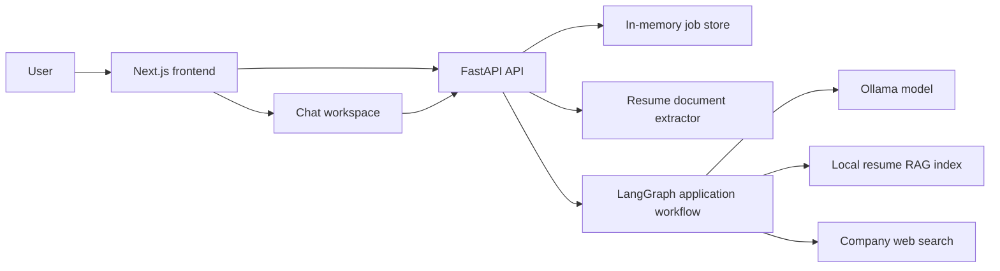
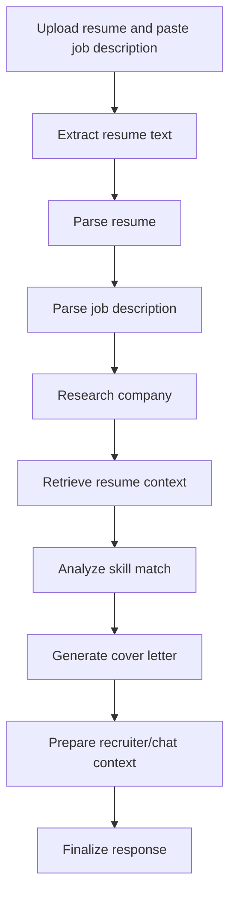
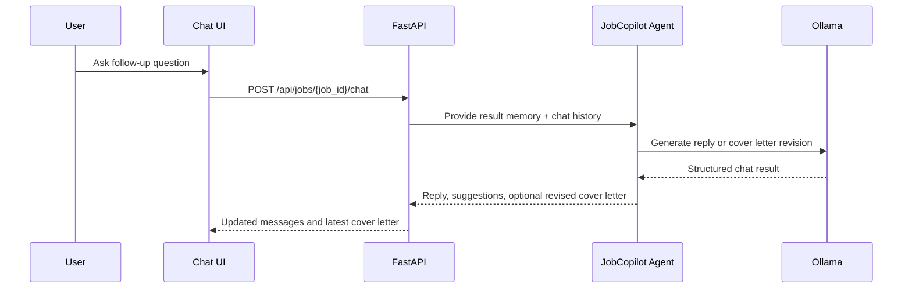

# CareerCopilot

CareerCopilot is a resume-aware job application assistant. It accepts a resume and job description, extracts and structures the candidate profile, researches the target company, retrieves relevant resume evidence, scores skill fit, writes a tailored cover letter, and opens a follow-up chat workspace for revisions.

The app is built with a FastAPI backend, a static-export Next.js frontend, LangGraph orchestration, LangChain Ollama integration, and lightweight local resume retrieval.

## Highlights

- Upload PDF, DOCX, or TXT resumes.
- Paste a job description and generate a complete application package.
- Parse resume and job description into structured Pydantic models.
- Retrieve relevant resume excerpts with a local RAG-style index.
- Search company context from the web and expose source links.
- Generate a cover letter, skill-match analysis, recruiter answers, and summaries.
- Continue into chat with application memory and optional web search.
- Preserve generated state during in-app navigation while clearing it on reload.
- Serve the exported frontend through FastAPI for single-process deployment.

## Screenshots

### Fig 1 - Initial Screen

Upload a PDF, DOCX, or TXT resume, paste the target job description, add optional recruiter questions, and choose whether company research should run as part of the application workflow.


### Fig 2 - Running Steps

A live pipeline tracker shows the agent moving through resume extraction, resume parsing, job parsing, company search, resume retrieval, skill matching, cover letter generation, and final packaging.


### Fig 3 - Cover Letter

JobCopilot generates a tailored cover letter from the uploaded resume, parsed job requirements, retrieved resume evidence, and live company research when enabled.


### Fig 4 - Skill Analysis

The skill analysis breaks down fit by requirement, highlights matched and missing skills, shows score bars, and summarizes recommendations for how to position the application.


### Fig 5 - Company Search

Company research pulls public web results for the target company and role, including snippets and source URLs. This context can feed directly into the generated cover letter and follow-up chat.


### Fig 6 - Chat With Live Cover Letter

After generation, the chat workspace keeps the application memory available for follow-up questions, interview prep, and cover letter edits. The latest cover letter stays visible on the right, suggested prompts help continue the conversation, and optional Web Search can bring in current public facts with source URLs.


## Architecture

### System Overview



### Generation Workflow



### Chat Flow



## Tech Stack

| Layer | Technology |
| --- | --- |
| Frontend | Next.js 16, React 19, TypeScript, Tailwind CSS, lucide-react |
| Backend | FastAPI, Uvicorn, Pydantic |
| Agent workflow | LangGraph |
| LLM integration | LangChain Ollama |
| Document parsing | pypdf, python-docx |
| Company search | httpx, BeautifulSoup, DuckDuckGo HTML results |
| Resume retrieval | Local token-based chunk scoring |
| Package management | venv + pip for Python, npm for frontend |

## Project Structure

```txt
.
|-- backend/
|   |-- .env                  # Local backend environment variables
|   |-- agent.py              # LangGraph workflow and LLM prompts
|   |-- company_search.py     # Company/web search helper
|   |-- documents.py          # PDF, DOCX, and TXT resume extraction
|   |-- main.py               # Uvicorn entrypoint
|   |-- resume_rag.py         # Local resume chunk retrieval
|   |-- schema.py             # Pydantic domain models
|   |-- server.py             # FastAPI app, job APIs, chat APIs, static serving
|   |-- settings.py           # Environment loading and Ollama settings
|   `-- requirements.txt      # Python dependencies
`-- frontend/
    |-- src/app/page.tsx       # Generator UI
    |-- src/app/chat/page.tsx  # Chat workspace
    |-- src/app/globals.css    # Global styling
    `-- next.config.ts         # Static export config
```

## Prerequisites

- Python 3.12+
- Node.js 20+
- Local Ollama server or Ollama Cloud API access

## Environment Variables

Create `backend/.env`:

```bash
OLLAMA_API_KEY=
OLLAMA_HOST=http://localhost:11434
OLLAMA_MODEL=gemma3:27b
```

For Ollama Cloud:

```bash
OLLAMA_HOST=https://ollama.com
OLLAMA_API_KEY=your_ollama_cloud_key
```

Optional server settings:

```bash
HOST=127.0.0.1
PORT=8000
RELOAD=false
CORS_ORIGINS=http://localhost:3000,http://127.0.0.1:3000
```

Frontend API override, if needed. Put this in `frontend/.env.local` or export it in the shell that starts `npm run dev`:

```bash
NEXT_PUBLIC_API_BASE_URL=http://127.0.0.1:8000
```

## Installation

Install backend dependencies:

```bash
cd backend
python -m venv .venv
.venv\Scripts\activate
python -m pip install --upgrade pip
python -m pip install -r requirements.txt
```

Install frontend dependencies:

```bash
cd ../frontend
npm install
```

## Running Locally

Start the FastAPI backend:

```bash
cd backend
.venv\Scripts\activate
python -m uvicorn server:app --reload --host 127.0.0.1 --port 8000
```

Start the Next.js frontend in another terminal:

```bash
cd frontend
npm run dev
```

Open:

```txt
http://localhost:3000
```

## Serving The Frontend From FastAPI

The frontend is configured for static export. Build it first:

```bash
cd frontend
npm run build
cd ../backend
```

Then start FastAPI:

```bash
.venv\Scripts\activate
python main.py
```

Open:

```txt
http://127.0.0.1:8000
```

FastAPI serves API routes under `/api/*` and falls back to the exported frontend for browser routes.

## API Reference

### `GET /api/health`

Returns service status and active Ollama configuration.

```json
{
  "status": "ok",
  "model": "gemma3:27b",
  "host": "http://localhost:11434"
}
```

### `POST /api/process`

Synchronous JSON endpoint for direct API use.

```json
{
  "resume_text": "Paste resume text here",
  "job_description_text": "Paste job description here",
  "recruiter_questions": ["Why are you interested in this role?"],
  "enable_company_search": true
}
```

### `POST /api/jobs`

Multipart endpoint used by the frontend. It starts a background job and returns a `job_id`.

| Field | Type | Required | Description |
| --- | --- | --- | --- |
| `resume_file` | File | No | PDF, DOCX, or TXT resume upload |
| `resume_text` | String | No | Pasted resume text; used when no file is supplied |
| `job_description_text` | String | Yes | Target job description |
| `recruiter_questions` | String | No | Newline-separated recruiter questions |
| `enable_company_search` | Boolean | No | Enables web research when true |

Response:

```json
{
  "job_id": "abc123"
}
```

### `GET /api/jobs/{job_id}`

Returns job status, step progress, final result, chat history, and latest cover letter.

Statuses:

- `queued`
- `running`
- `completed`
- `failed`

### `POST /api/jobs/{job_id}/chat`

Follow-up chat endpoint for completed jobs. The backend provides the parsed resume, parsed job description, company research, resume RAG context, skill match analysis, chat history, and latest cover letter as memory.

```json
{
  "message": "Make the cover letter more concise.",
  "cover_letter_text": "Optional latest cover letter text",
  "enable_web_search": false
}
```

## Backend Job Steps

The frontend displays these pipeline steps:

| Step | Purpose |
| --- | --- |
| Resume document | Extract text from uploaded resume |
| Resume parsing | Structure candidate details, experience, education, and skills |
| Job parsing | Structure company, role, responsibilities, and requirements |
| Company search | Find company context and links |
| Resume RAG | Retrieve the strongest resume excerpts for the role |
| Skill matching | Compare job requirements with resume evidence |
| Cover letter | Generate the tailored cover letter |
| Follow-up chat | Prepare context for later chat |
| Finalize | Package the final response |

## Development Checks

Backend:

```bash
cd backend
.venv\Scripts\activate
python -m py_compile agent.py main.py server.py settings.py utils.py schema.py documents.py company_search.py resume_rag.py
```

Frontend:

```bash
cd frontend
npm run lint
npm run typecheck
npm run build
```

## Notes And Limitations

- Jobs are stored in memory, so they are lost when the backend process restarts.
- The generated frontend state is stored in browser session storage for navigation convenience.
- Company research depends on public DuckDuckGo HTML results and can fail or return sparse snippets.
- Local Ollama performance depends heavily on model size and available CPU/GPU resources.
- Resume RAG is local and lightweight; it does not require a vector database.
- Free or hosted model APIs can improve latency, but review provider privacy terms before sending resumes or personal data.
